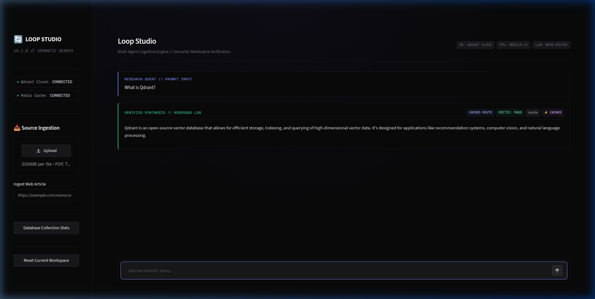
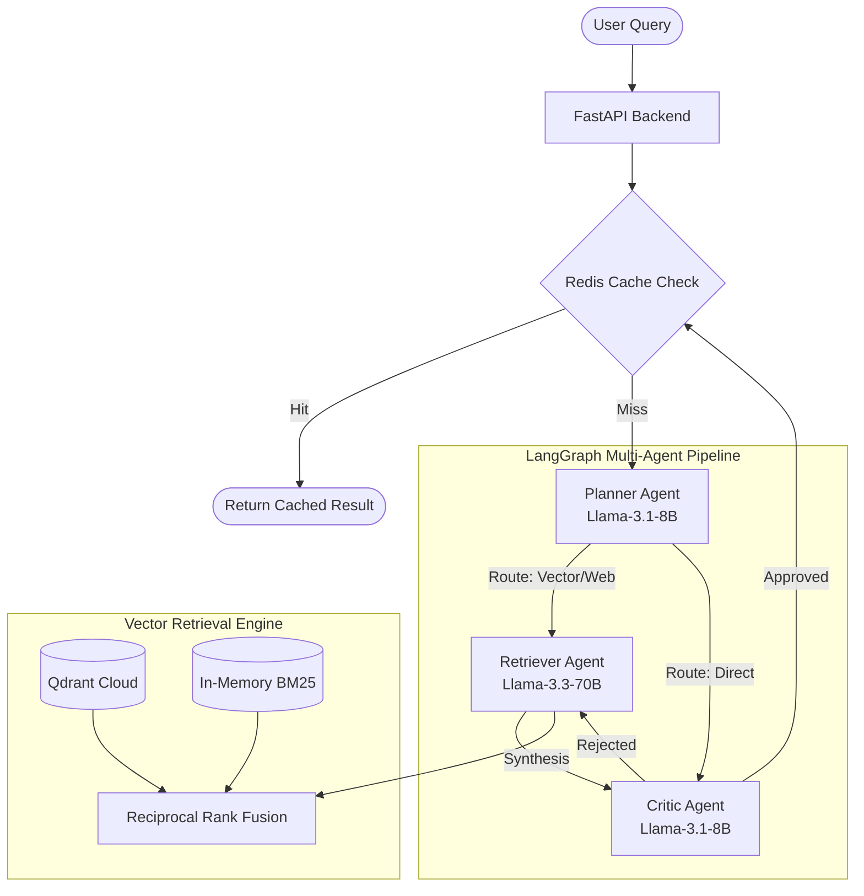

#  Loop Studio — Multi-Agent Semantic Research Engine



**Loop Studio** is a production-grade, high-performance semantic search and synthesis engine built specifically for low-resource hardware environments. By strategically distributing workloads—running heavy vector embeddings locally on CPU while offloading intensive agentic reasoning and LLM generation to the cloud—Loop Studio achieves state-of-the-art Retrieval-Augmented Generation (RAG) performance on minimal hardware (e.g., Intel Core i3 11th Gen, 8GB RAM).

The system coordinates local hybrid vector search with cloud-based LLM agents using **LangGraph** orchestration, all presented through a custom-built, premium Dark Slate developer console powered by Streamlit and FastAPI.

---

##  Key Features

- **Premium Workspace Interface**: A completely custom, minimalist Dark Slate UI built on Streamlit. We override default components with tailored CSS to deliver an elite, high-fidelity console experience reminiscent of top-tier developer tools.
- **Hybrid Semantic Search**: Implements advanced retrieval by combining dense semantic vector search (local `MiniLM-L6-v2` embeddings) with sparse keyword matching (`BM25`). The results are intelligently merged and re-ranked using **Reciprocal Rank Fusion (RRF)** for unparalleled accuracy.
- **Agentic Pipeline (LangGraph)**: Utilizes a directed acyclic graph to route and process queries. The system dynamically decides whether to query the vector database, execute a web search, or answer directly, ensuring maximum efficiency and minimal hallucination.
- **Multi-Model Routing**: Automatically selects the optimal LLM for the task. Fast, lightweight models (`Llama-3.1-8B`) handle routing and criticism, while heavy synthesis is delegated to powerful models (`Llama-3.3-70B`).
- **Memory & Caching**: Integrates a Redis-backed caching layer and conversation memory to instantly serve recurring queries and maintain context across multi-turn sessions.
- **Advanced Evaluation Suite**: Built-in RAGAS evaluation pipeline to mathematically score agent responses for Faithfulness, Answer Relevancy, Context Precision, and Context Recall using local embedding judges.

---

##  System Architecture

### High-Level Workflow



### The Cognitive Agents

1. **The Planner (`Llama-3.1-8B`)**: Acts as the intelligent router. It analyzes the user's prompt and decides the most efficient path. If the query is conversational, it bypasses retrieval. If it requires specific knowledge, it triggers the Retriever.
2. **The Retriever (`Llama-3.3-70B`)**: The workhorse. It formulates optimized search queries, executes the hybrid search against Qdrant and BM25, and synthesizes a comprehensive response based *only* on the retrieved context.
3. **The Critic (`Llama-3.1-8B`)**: The quality assurance layer. It evaluates the Retriever's synthesis against the raw retrieved context nodes. If it detects hallucinations or ungrounded claims, it rejects the answer and forces a retry.

---

##  Getting Started

### 1. Prerequisites
- **Python 3.10+**
- **Docker** (Optional, for running a local Redis or Qdrant instance)
- **Groq API Key**: For ultra-fast cloud LLM inference. Get a free key at [console.groq.com](https://console.groq.com).
- **Qdrant Cloud**: A free tier cluster URL and API key from [Qdrant Cloud](https://cloud.qdrant.io/).

### 2. Installation & Setup

Clone the repository and set up the environment:
```bash
# Clone the repository
git clone <repo-url>
cd LLM_loop

# Initialize and activate a virtual environment
python -m venv .venv
source .venv/bin/activate

# Install the package and development dependencies in editable mode
pip install -e ".[dev]"
```

Configure your environment variables:
```bash
# Copy the example environment file
cp .env.example .env

# Open .env and populate it with your specific API keys
# GROQ_API_KEY=gsk_...
# QDRANT_URL=https://...
# QDRANT_API_KEY=...
```

### 3. Running the Infrastructure

If you are using local Redis for caching, you can spin it up via Docker Compose:
```bash
docker compose up -d redis
```

Start the **FastAPI Backend Server**:
```bash
uvicorn src.api.main:app --reload
```
*The API will be available at `http://localhost:8000`.*

Start the **Loop Studio Console (UI)**:
```bash
streamlit run src/client/app.py
```
*The UI will automatically open in your browser at `http://localhost:8501`.*

---

##  Project Structure

```text
LLM_loop/
├── src/
│   ├── agents/          # LangGraph nodes (Planner, Retriever, Critic)
│   ├── api/             # FastAPI application, routes, and dependencies
│   ├── client/          # Streamlit UI, custom CSS, and frontend logic
│   ├── config/          # Pydantic settings and environment management
│   ├── ingestion/       # Document loaders, text splitters, and local embedders
│   ├── llm/             # Groq client wrappers and router utilities
│   ├── memory/          # Redis caching and conversational memory management
│   └── vectorstore/     # Hybrid search orchestration, Qdrant client, and BM25
├── tests/               # Pytest suite for backend and agent validation
├── scripts/             # Data seeding and evaluation scripts
├── .streamlit/          # Native Streamlit theme configuration (Dark Mode)
├── docker-compose.yml   # Infrastructure definitions
├── pyproject.toml       # Python package and dependency definitions
└── README.md
```

---

##  API Reference

The backend provides a robust REST API for programmatic access to the research engine.

| Endpoint | Method | Description |
| :--- | :--- | :--- |
| `/health` | `GET` | Returns system health status and cache connectivity metrics. |
| `/api/v1/chat` | `POST` | Dispatches a query message through the LangGraph pipeline. |
| `/api/v1/ingest/upload` | `POST` | Uploads, chunks, embeds, and ingests a local document (PDF/TXT/MD). |
| `/api/v1/ingest/web` | `POST` | Crawls, parses, and ingests content from a remote URL. |
| `/api/v1/ingest/status` | `GET` | Retrieves vector store statistics and current point counts. |
| `/api/v1/chat/session/{id}` | `DELETE` | Clears the active conversational memory cache for a specific session. |

---

##  Development & Testing

We enforce strict quality standards using `pytest` and `ruff`.

**Run the test suite:**
```bash
pytest tests/ -v
```

**Run the linter:**
```bash
ruff check src/
```

**Evaluate Pipeline Accuracy:**
Run the standard evaluation script to benchmark routing and generation accuracy:
```bash
python -m scripts.evaluate
```

**Advanced RAGAS Evaluation:**
To test the pipeline against industry-standard RAG metrics (Faithfulness, Answer Relevancy, Context Precision, and Context Recall), use the built-in RAGAS script. This script uses the local MiniLM embeddings and Groq LLMs as judges to measure groundedness without incurring extra API costs.

*Note: You may need to install the evaluation dependencies first (`pip install ragas datasets langchain-huggingface langchain-google-vertexai`).*

```bash
# Clear the cache first to ensure requests hit the full Retriever pipeline
curl -X DELETE http://localhost:8000/api/v1/chat/session/your-session-id

# Run the RAGAS evaluation
python -m scripts.evaluate_ragas --api-base http://localhost:8000
```

---
